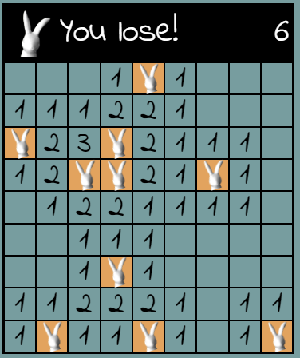
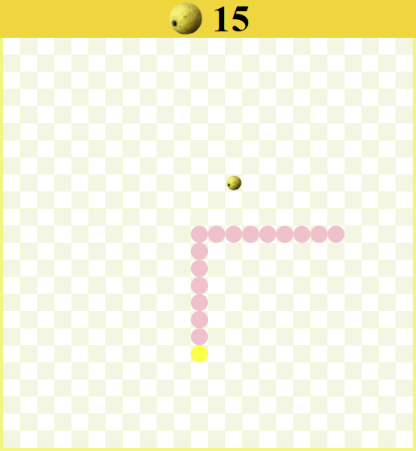

# Games for fun!

Some of my JavaScript-Browsergames! Oh what a fun!

## Play them:

https://larspefegames.herokuapp.com/

## Description:

When I started to learn JavaScript, I got really passionated about Game Development,
it's a lot of fun, and at the same time I dived deeper into JavaScript and got
more and more practical experience with JS. Happy Coding!

1. Rabbit Tracker (like Minesweeper)
2. Classic Sudoku
3. Classic Memory Game. You can choose between pictures, numbers or colors(but this is impossible)
4. Connect Four
5. Snake
6. BreakOut: My first game!

## DEMO

## Tech Stack:

-   Vanilla JavaScript
-   JQuery
-   HTML
-   CSS
